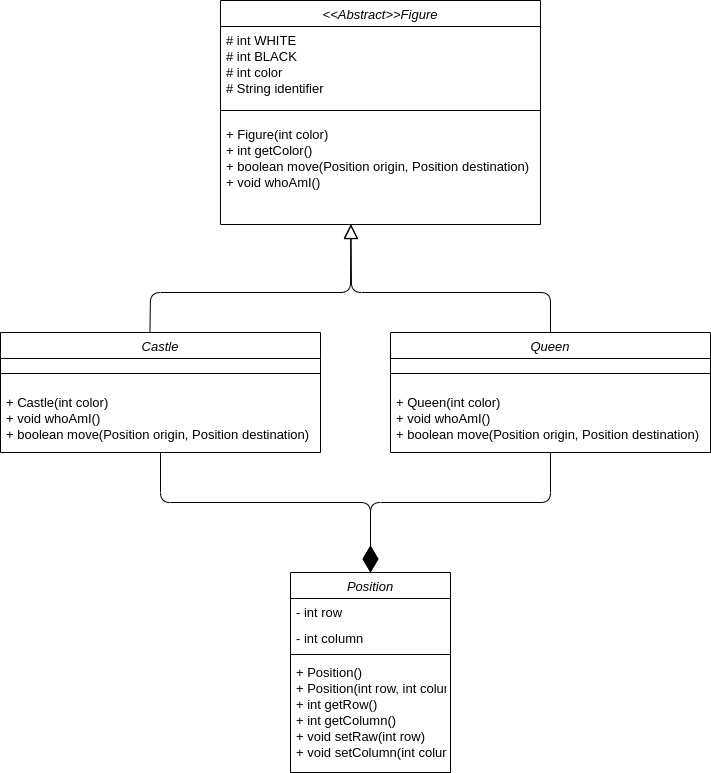
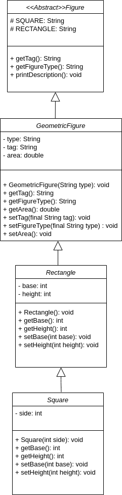

# io2.1. Inheritance and references to the base class

## Exercise 1

#### Class Diagram 

#### Questions:
1. Which methods can be really invoked on the collection elements?
    - Figure(int color)
    - int getColor()
    - boolean move(Position origin, Position destination)
    - void whoAmI()
2. If Castle class has implemented void castle() method, could it be possible to invoke that method from a reference to the base class? Why?
    - It’s not possible because void castle() is property of Castle class
3. What should we have to do in order to be able to use the previous void castle() method from an object of Castle class that is pointed by a reference to Figure class?
    - .
   
4. What should we do to know exactly to which class belongs every object pointed by a reference to the base class?
    - .

## Exercise 2

#### Class Diagram 

