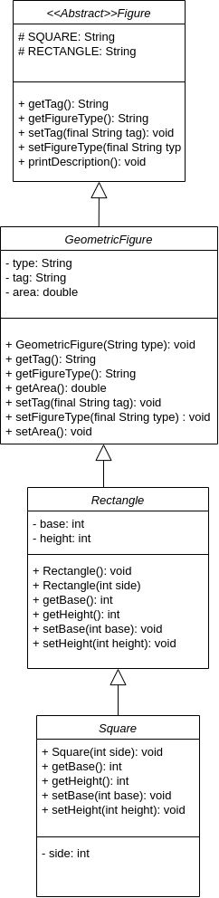

# 2.1. Inheritance and references to the base class

## Exercise 1

#### Class Diagram 

#### Questions:
1. Which methods can be really invoked on the collection elements?
    - Figure(int color)
    - int getColor()
    - boolean move(Position origin, Position destination)
    - void whoAmI()
2. If Castle class has implemented void castle() method, could it be possible to invoke that method from a reference to the base class? Why?
    - It’s not possible because void castle() is property of Castle class
3. What should we have to do in order to be able to use the previous void castle() method from an object of Castle class that is pointed by a reference to Figure class?
    - .
   
4. What should we do to know exactly to which class belongs every object pointed by a reference to the base class?
    - .

## 2.2. Exercise to practice with Figures

### Class Diagram 

 #### Rectangle
  1. Show the difference between a class and an object.
    - Object is instance of class
  1. Which steps are involved in the instantiation's process of an object ?
    - Declare variable name with an object type
    - Use **new** for create the object
  1. How is an object instantiated in Java ?
    - instanceof
  
  #### Square
  1. What is inheritance?
    - .
  1. How do you express in Java that one class inherits from another?
    - .
  1. Which methods of the superclass are visible from the subclasses?
    - .
  1. What is the meaning of method overriding?
    - .
  1. Remember that, opposite to the rest of the methods of a class, subclasses don't automatically inherit constructors from the superclass, but they can be invoked by the use of super() keyword.
    - .

### Reference to interfaces.

  1. Which type are both instantiated objects (in options 1 and 2)?
    - .
  1. Which type is the variable that references them?
    - .
  1. Which methods from superclass are visible from the subclass?
    - .
  1. Can you use the same variable as a reference for different types of figures? Why?
    - .